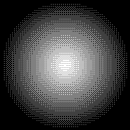

# Dithering Example



This minimal example in C++ demonstrates [ordered dithering](https://en.wikipedia.org/wiki/Ordered_dithering) using a 4x4 Bayer matrix.

## Usage

From the root directory, build the project and run `build/main`. The example output will be saved as `circle.png`.

```sh
cd DitheringExample
make
./main
```
